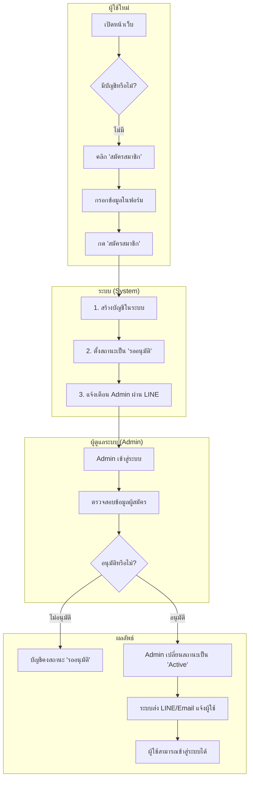

## Flowchart 1: ขั้นตอนการสมัครสมาชิกและการอนุมัติผู้ใช้ใหม่

```mermaid
graph TD
    subgraph "ผู้ใช้ใหม่"
        A[เปิดหน้าเว็บ] --> B{มีบัญชีหรือไม่?};
        B -->|ไม่มี| C[คลิก 'สมัครสมาชิก'];
        C --> D[กรอกข้อมูลในฟอร์ม];
        D --> E[กด 'สมัครสมาชิก'];
    end

    subgraph "ระบบ (System)"
        E --> F[1. สร้างบัญชีในระบบ];
        F --> G[2. ตั้งสถานะเป็น 'รออนุมัติ'];
        G --> H[3. แจ้งเตือน Admin ผ่าน LINE];
    end

    subgraph "ผู้ดูแลระบบ (Admin)"
        H --> I[Admin เข้าสู่ระบบ];
        I --> J[ตรวจสอบข้อมูลผู้สมัคร];
        J --> K{อนุมัติหรือไม่?};
    end

    subgraph "ผลลัพธ์"
        K -->|ไม่อนุมัติ| L[บัญชีคงสถานะ 'รออนุมัติ'];
        K -->|อนุมัติ| M[Admin เปลี่ยนสถานะเป็น 'Active'];
        M --> N[ระบบส่ง LINE/Email แจ้งผู้ใช้];
        N --> O[ผู้ใช้สามารถเข้าสู่ระบบได้];
    end
```
