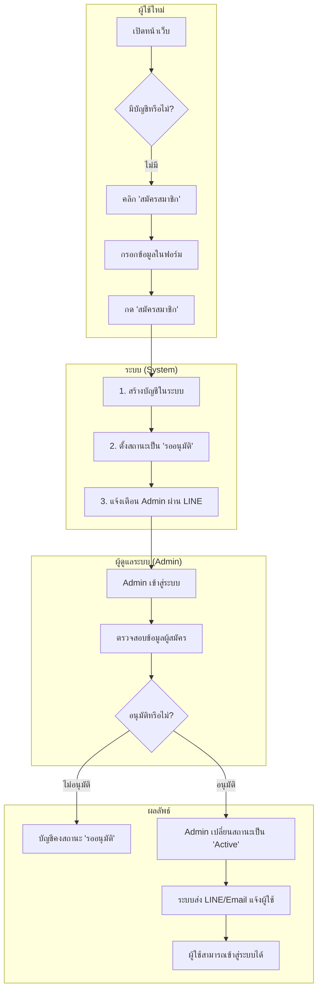
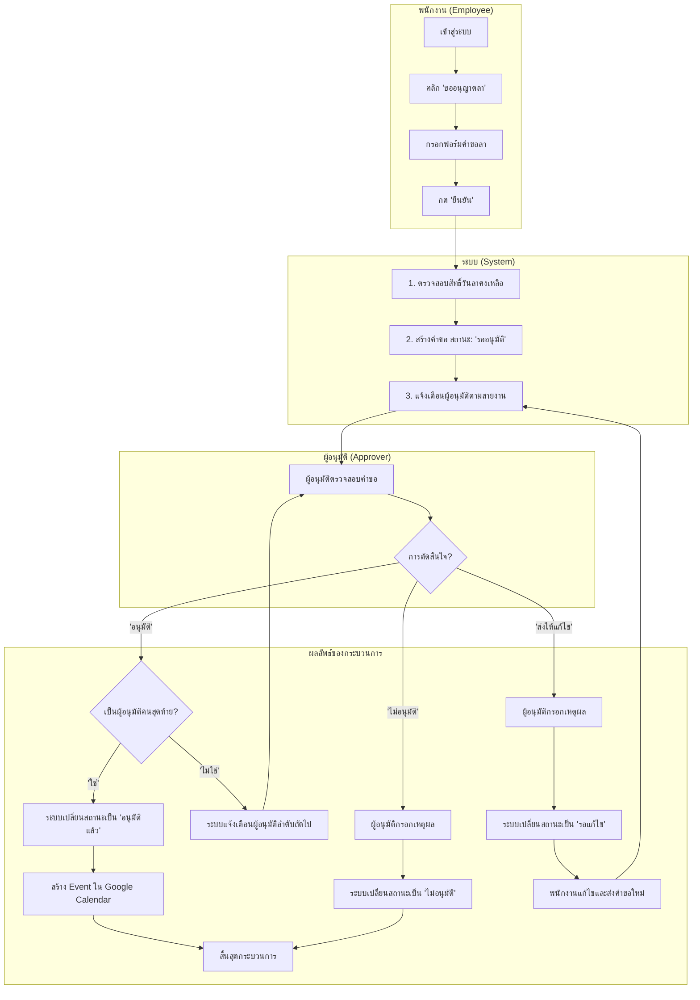
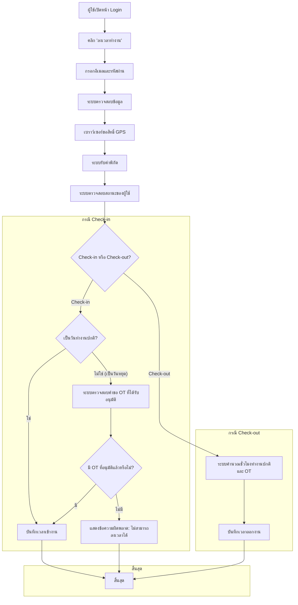
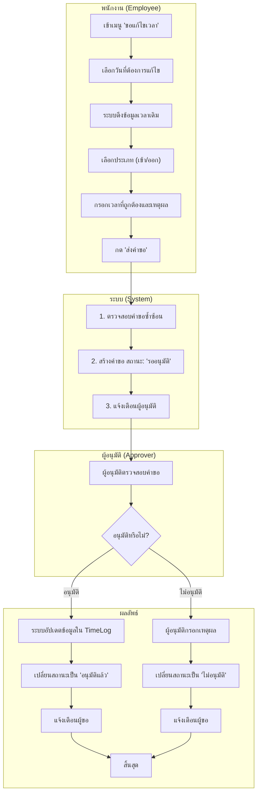
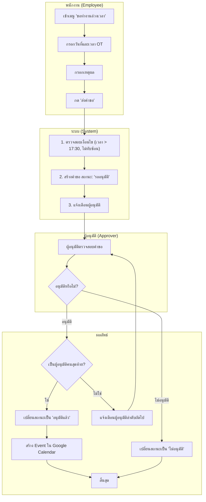
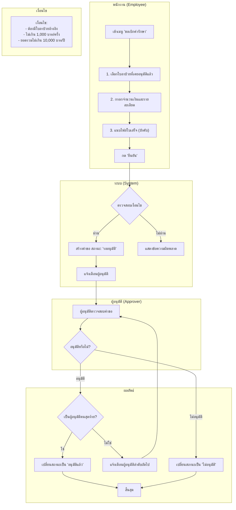

## Flowchart 1: ขั้นตอนการสมัครสมาชิกและการอนุมัติผู้ใช้ใหม่

## Flowchart 2: กระบวนการขอลาและการอนุมัติ (Leave Request & Approval)

## Flowchart 3: กระบวนการลงเวลาทำงาน (Check-in/Check-out)

## Flowchart 4: กระบวนการขอแก้ไขเวลา (Time Correction Request)

## Flowchart 5: กระบวนการขอทำงานล่วงเวลา (OT Request)

## Flowchart 6: กระบวนการขอเบิกค่ารักษา (Medical Claim)

